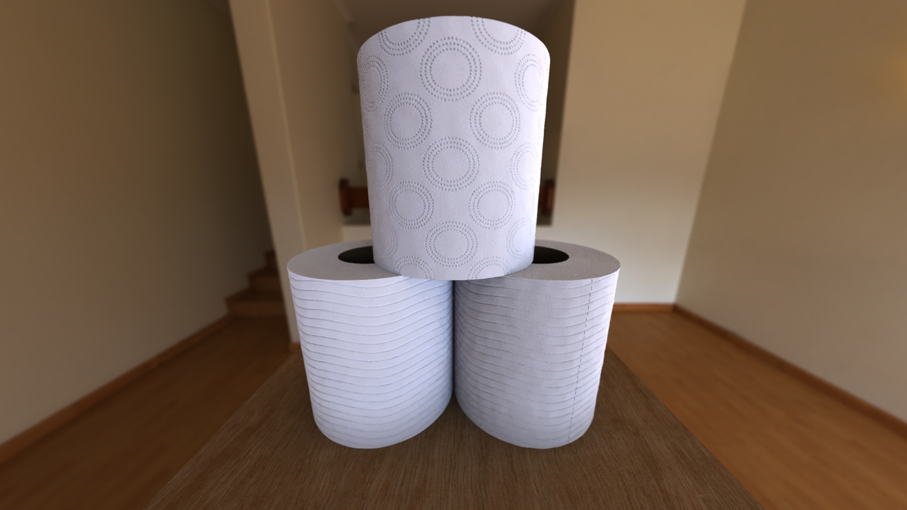
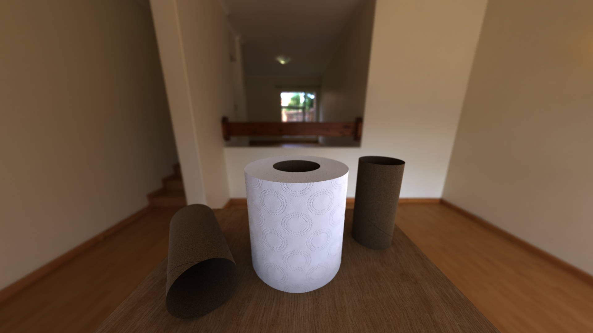

# RenderMan: Toilet Roll
*Josh Bailey* 
*Rendering.* 
*NCCA, Bournemouth University.* 
*2020 - 2021.* 

## Contents
- [RenderMan: Toilet Roll](#renderman-toilet-roll)
  - [Contents](#contents)
  - [Overview](#overview)

## Overview
Creating a simple photorealistic render, of a Toilet Roll, using <i>Pixar's RenderMan</i> API for Python.

